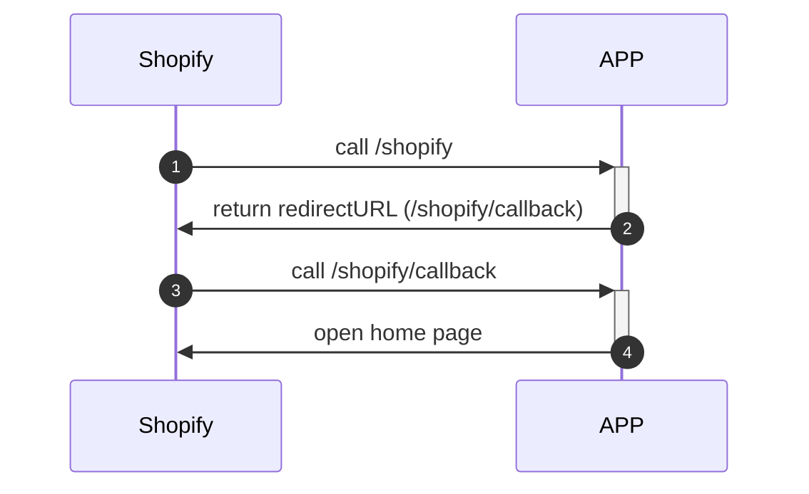

# Shopify App Example

This is a sample of the Shopify integration app using Golang.

## How To Run

- Install `ngrok`
- Run `ngork`

```
$ ngrok http 3434
```

- Create the file `.env-example` in the root directory and rename it to '.env'.

```
$ cp .env-example .env
```

- Change the value with your Shopify credential and add your server URL.
- run docker compose

```
$ docker-compose -f docker-compose.yaml up -d mongo --remove-orphans
```

- run main.go

## Sequence Diagram



## TODO

- implement background job to manage webhook (product)
